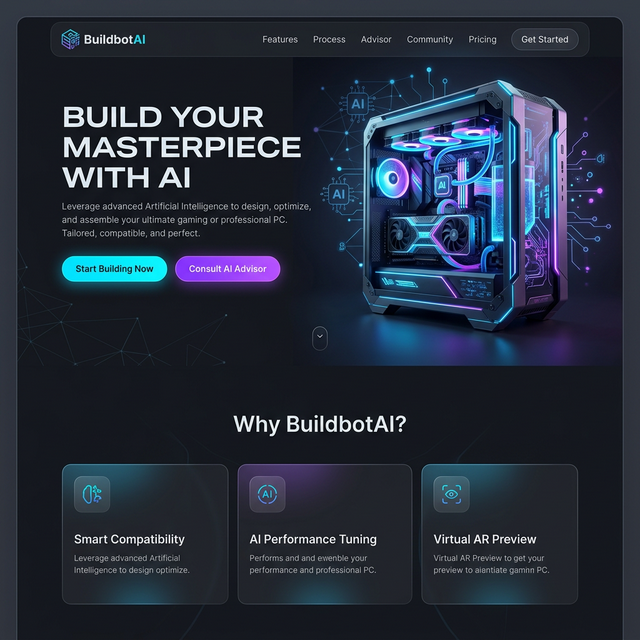

# 🌌 Buildbot AI: Forge Architect

> **Elevating the PC Building Experience through Intelligent Orchestration and Immersive Design.**

Buildbot AI is a state-of-the-art PC building assistant that bridges the gap between complex hardware specifications and user intent. Powered by Google's Gemini and Genkit, it offers a seamless, AI-driven journey from component selection to performance optimization.



---

## ✨ Key Features

| 🤖 AI Build Advisor | 📊 Performance Analytics | 🛠️ Prebuilt Builder |
| :--- | :--- | :--- |
| Get real-time critiques and hardware recommendations based on your budget and needs. | Visualize FPS estimations across different resolutions and games before you buy. | Professional-grade tools for creating and managing optimized system configurations. |

| 💎 Immersive UI | 🛡️ Admin Command Center | ⚡ Real-time Sync |
| :--- | :--- | :--- |
| A "Sleek Tech" aesthetic featuring glassmorphism, fluid animations, and premium dark mode. | Comprehensive management of inventory, sales, and system reservations. | Powered by Firebase for instantaneous updates across all user sessions. |

---

## 🏗️ The 3-Layer Architecture

Buildbot AI follows a rigorous 3-layer architecture to ensure that probabilistic AI decision-making is grounded in deterministic execution.

1.  **Directive (What to do):** Standard Operating Procedures (SOPs) defined in Markdown (`directives/`).
2.  **Orchestration (Decision making):** The AI Agent layer that interprets intent and routes tasks.
3.  **Execution (Doing the work):** Deterministic scripts (`execution/`) and CLI tools for reliable operations.

---

## 🛠️ Tech Stack

- **Frontend:** [Next.js 15](https://nextjs.org/) (App Router), [React 19](https://react.dev/), [Tailwind CSS](https://tailwindcss.com/)
- **AI Engine:** [Google Gemini](https://aistudio.google.com/), [Firebase Genkit](https://firebase.google.com/docs/genkit), [Vercel AI SDK](https://sdk.vercel.ai/)
- **Backend:** [Firebase](https://firebase.google.com/) (Auth, Firestore, Hosting)
- **3D & Motion:** [React Three Fiber](https://r3f.docs.pmnd.rs/), [Three.js](https://threejs.org/), [Framer Motion](https://www.framer.com/motion/)
- **Analytics:** [Recharts](https://recharts.org/)

---

## 🚀 Getting Started

### 1. Prerequisites
- Node.js 18+
- npm

### 2. Installation
```bash
git clone https://github.com/VirgenRayzon/BuilbotAI.git
cd BuilbotAI
npm install
```

### 3. Environment Configuration
Create a `.env` file in the root and add your credentials:
```env
# Firebase Configuration
NEXT_PUBLIC_FIREBASE_API_KEY=your_key
NEXT_PUBLIC_FIREBASE_AUTH_DOMAIN=your_domain
NEXT_PUBLIC_FIREBASE_PROJECT_ID=your_id
NEXT_PUBLIC_FIREBASE_STORAGE_BUCKET=your_bucket
NEXT_PUBLIC_FIREBASE_MESSAGING_SENDER_ID=your_id
NEXT_PUBLIC_FIREBASE_APP_ID=your_app_id

# AI Configuration
GEMINI_API_KEY=your_gemini_api_key
```

### 4. Running the Development Environment
Buildbot AI requires two concurrent processes:

**Terminal 1 (Web Interface):**
```bash
npm run dev
```
*Access at: [http://localhost:9002](http://localhost:9002)*

**Terminal 2 (AI Services):**
```bash
npm run genkit:dev
```
*Required for Build Advisor and AI flows.*

---

## 🎨 Design Philosophy
The project adheres to the **"Sleek Tech & Immersive"** aesthetic defined in `DESIGN.md`.
- **Primary Color:** Tech Blue (#448FC4)
- **Background:** Midnight Canvas (#21262B)
- **Accents:** Cyan Glow and Vibrant Purple Gradients

---

## 📄 Documentation
For deeper insights into the project, refer to:
- [DESIGN.md](DESIGN.md) - Visual identity and UI rules.
- [AGENTS.md](AGENTS.md) - Instructions for AI collaborators.
- [PROJECT_STRUCTURE.md](docs/project_structure.md) - Codebase organization.

---

Built with ❤️ by the Buildbot AI Team.
